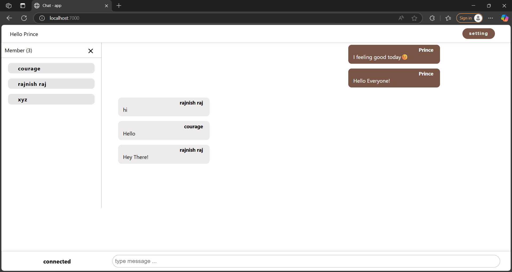
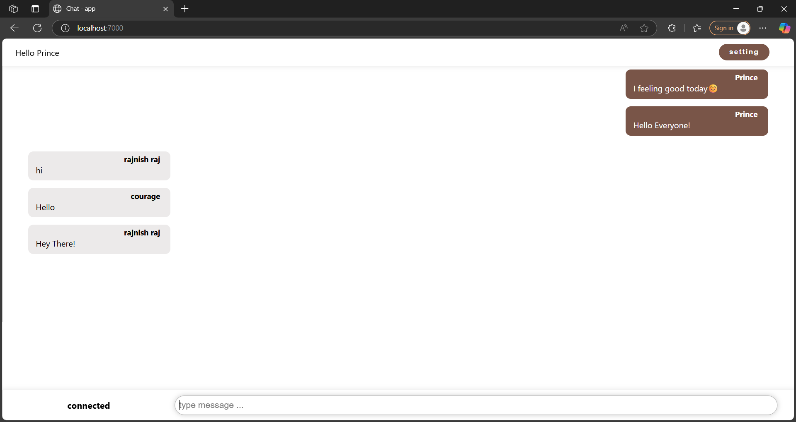

#  Real-Time Chat Application

A simple real-time chat application built with **HTML**, **CSS**, and **JavaScript** on the frontend, and **Node.js**, **Express.js**, and **WebSocket** on the backend. This app allows users to chat in real-time, with messages stored in a local file.

---

##  Features

- Real-time two-way communication using WebSockets
- Simple and clean UI with HTML/CSS
- Backend server with Express.js and Node.js
- Chat messages stored locally in a file
- Lightweight and easy to run locally

---

## 🛠 Tech Stack

### Frontend
- HTML
- CSS
- JavaScript

### Backend
- Node.js
- Express.js
- WebSocket 

### Storage
- Local file system (`fs` module)

---

## Screenshots




##  Installation

1. Clone the repository:

```bash
git clone https://github.com/Rajnish8292/chat.git
cd chat

```


2. Install Dependencies
```bash
npm install
```

3. Run the server
 ```bash
npm run start
#or
node server.js
```

Open http://localhost:7000 to view the web app in your browser


## Author
Made by Rajnish Raj
### Connect on [LinkedIn](https://www.linkedin.com/in/rajnish-raj-9139602a4/)
